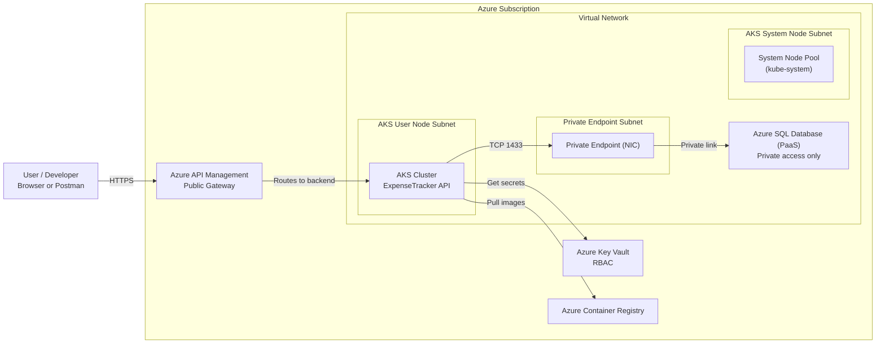
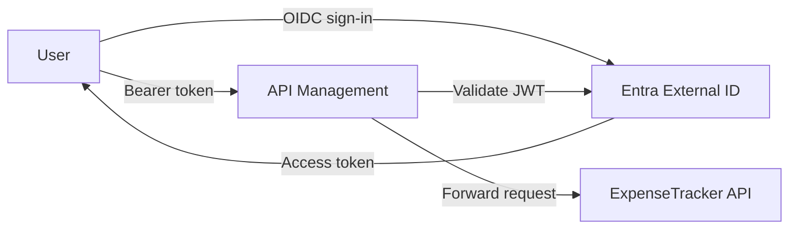
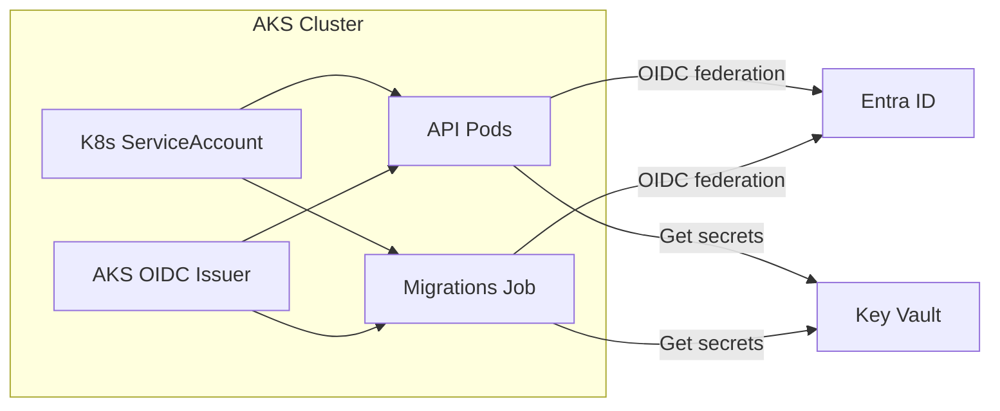
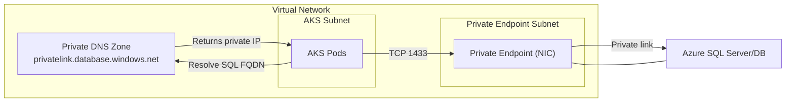

## Diagram 1 — Architecture Overview (what exists + main flows)

---

## Diagram 2 — Request Authentication (user → Entra → APIM → API)

---

## Diagram 3 — Workload Identity + Key Vault (API/Migrations → secrets)

---

## Diagram 4 — Private Networking (AKS → SQL via Private Endpoint + Private DNS)

